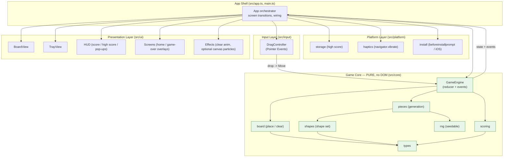
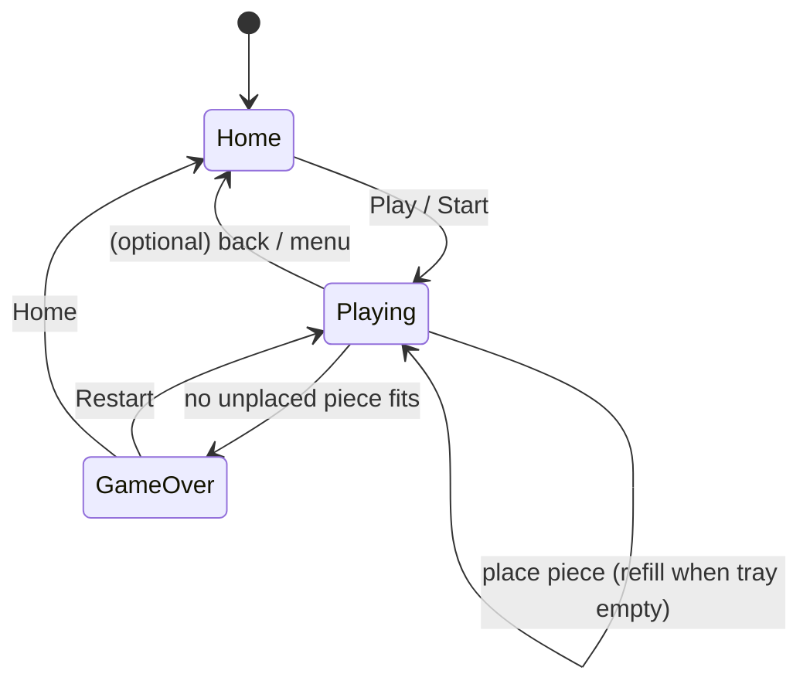

# Detailed Design: Wood Block Puzzle (PWA)

## Overview

Wood Block Puzzle is a casual, offline-capable, drag-and-drop block-placement puzzle in the style of the classic wood-themed block games (1010! / Block Blast!). It is delivered as an **installable Progressive Web App (PWA)**: it runs in any modern desktop browser, installs to the home screen on Android and iOS, and — once loaded — works **fully offline**. A hard product requirement is that it **looks and feels like a native app**, not a web page: standalone display with no browser chrome, safe-area-aware full-viewport layout, 60fps touch dragging, subtle haptics, and app-like screen transitions.

The application is split into two clearly separated concerns:

1. A **pure, framework-free game core** (board state, shape set, piece generation, placement validation, line clearing, scoring, game-over detection) that has no knowledge of the DOM and is exercised entirely by unit tests.
2. A **thin presentation + platform layer** (DOM rendering, pointer-based drag input, PWA plumbing, storage, haptics, install affordance) that observes the core and animates its state transitions.

The stack is **TypeScript + Vite + Vitest**, with `vite-plugin-pwa` (Workbox) generating the service worker and injecting the web app manifest. Rendering uses **DOM elements animated with CSS transforms** (a transparent `<canvas>` overlay is reserved as an optional later enhancement for line-clear particle effects only).

This document is self-contained: all requirements, data models, interfaces, diagrams, and rationale needed to implement the game are inlined here.

---

## Detailed Requirements

### Platform & delivery
- **R1.** Plain HTML5 + CSS + **TypeScript**, no heavy UI framework. Built with **Vite**; `npm run dev` serves a hot-reloading dev server, `npm run build` outputs static files to `dist/`.
- **R2.** Ship a complete PWA: a web app manifest (name, short name, icons in all required sizes, `display: standalone`, `theme_color`, `background_color`, `orientation: portrait`) and a service worker that **precaches all app assets** so the game works fully offline after first load.
- **R3.** No backend, no ads, no accounts, no third-party network calls. All logic and assets are local.
- **R4.** Provide install/run instructions for HTTPS/localhost (required for service workers + install).
- **R5.** Dependencies minimal and **pinned** to exact versions.

### Native-app feel (hard requirement)
- **R6.** Standalone display when installed (no address bar). iOS-specific meta tags present: `apple-mobile-web-app-capable`, `apple-mobile-web-app-status-bar-style`, `apple-touch-icon`, plus a launch/splash appearance.
- **R7.** Full-viewport, app-like layout. Respect safe-area insets via `env(safe-area-inset-*)`. No page scrolling/bounce, no text selection, no long-press context menus on game elements, no pinch-zoom.
- **R8.** Touch-first 60fps interaction. Drag-and-drop via **Pointer Events** (touch + mouse unified). Precise, momentum-free dragging. Animations use GPU-friendly `transform`/`opacity` only.
- **R9.** Subtle haptic feedback on placement and line-clear where supported (`navigator.vibrate`), feature-detected and silently skipped otherwise.
- **R10.** Polished warm-wood visuals: rounded tactile blocks with depth/shadow; smooth animations for placing, clearing lines, score pop-ups, and a game-over transition. Custom app icon and consistent theme color.
- **R11.** App-like navigation between a **home/start screen**, an **in-game view**, and a **game-over overlay**, using in-place transitions (no full page reloads).
- **R12.** An **"Install app" affordance**: handle `beforeinstallprompt` (Android/desktop Chrome) to trigger the native prompt; on iOS (no programmatic prompt) show "Add to Home Screen" guidance.

### Layout (form-factor policy)
- **R13.** **Centered portrait app-frame.** On phones the game fills the viewport (safe-area aware). On wider/desktop viewports it renders as a phone-like portrait column with a capped max-width, centered on a warm wood backdrop, so it reads as "the app" on every screen. A single layout; no landscape mode in core scope.

### Core gameplay
- **R14.** Board: **8×8** grid of square cells, wood-themed.
- **R15.** Tray: exactly **3 pieces** shown at a time below the board. Pieces are polyomino shapes drawn from a **defined shape set** (enumerated in Data Models). **No rotation.**
- **R16.** Piece selection: **uniform random** — each of the 3 pieces drawn independently and uniformly from the shape set via a **seedable RNG** (seed enables deterministic tests). **No solvability guarantee**; the game can end on an unlucky draw.
- **R17.** Placement: a piece may be placed only if **all** its cells land on empty, in-bounds cells. A **live preview highlight** is shown while dragging; invalid drops are **rejected** and the piece **animates back** to the tray.
- **R18.** Refill: when **all 3** tray pieces have been placed, generate a new set of 3.
- **R19.** Line clearing: clear any **full row or full column** (all 8 cells). **Multiple lines can clear simultaneously.** Rows and columns are evaluated together after each placement.
- **R20.** Scoring: **+1 point per placed cell**, plus a line-clear bonus of `10 × k(k+1)/2` where `k` = number of lines (rows + columns) cleared by a single placement → 1 line = 10, 2 = 30, 3 = 60, 4 = 100, etc. Display current score and a **persisted high score** (localStorage).
- **R21.** Game over: the game ends when **none** of the currently unplaced tray pieces can fit anywhere on the board. Show a **Game Over overlay** with final score and **Restart**.

### Persistence
- **R22.** **High score only** is persisted (localStorage). Every launch starts a fresh game. Persistence must degrade gracefully if storage is unavailable (private mode / quota).

### Technical structure & quality
- **R23.** Game logic is fully separated from rendering/input/PWA plumbing and is **unit-testable in isolation** with no DOM dependency.
- **R24.** **Verification:** Vitest unit tests cover all core logic (placement validation, line clearing, scoring, game-over detection, piece generation, RNG determinism, storage). A **scripted headless-Chrome Lighthouse** run reports the PWA installability/offline result. Device-only checks (iOS Add-to-Home-Screen, on-device install/offline) are **documented as manual steps** in the README. The delivery is explicit about what is automated vs. verified manually.

### Deliverables
- **R25.** Complete source, runnable locally and buildable to static files.
- **R26.** Web app manifest, service worker, and all icon/splash assets (placeholder wood-themed icons generated from an SVG source).
- **R27.** README with game rules, local run/build steps, and install instructions for Android (Chrome), iOS (Safari → Add to Home Screen), and desktop.
- **R28.** Unit tests for core logic.
- **R29.** A Lighthouse PWA/installability check with the reported score and pass/fail against installability + offline criteria.

### Scope boundary (deferred optional extras)
- **R30.** Out of core scope, delivered only as post-core suggestions: sound effects, advanced haptics patterns, combo streak multipliers, undo, resume-in-progress game, additional themes, and the canvas particle overlay.

---

## Architecture Overview

The app is a layered architecture. Dependencies point **downward only**: the core layer depends on nothing; the UI/input/platform layers depend on the core; the app shell wires them together. This keeps the core pure and testable and confines all browser APIs to the outer layers.



### Event-driven core

The `GameEngine` is a **reducer**: it accepts the current `GameState` and a `Move`, and returns a new state **plus a list of semantic events** describing what happened (piece placed, lines cleared, score changed, tray refilled, game over). The presentation layer reacts to these events to run animations. This is the seam that lets the core stay pure — the core says *what* happened; the UI decides *how* to show it.

### Data flow for a single placement

```mermaid
sequenceDiagram
    participant U as User (pointer)
    participant D as DragController
    participant BV as BoardView
    participant G as GameEngine (pure)
    participant A as App
    participant S as storage
    participant H as haptics

    U->>D: pointerdown on tray piece
    D->>BV: show drag ghost + live preview highlight
    U->>D: pointermove
    D->>G: canPlace(board, shape, coord)?  (pure query)
    G-->>D: valid / invalid
    D->>BV: update preview (valid=green / invalid=red)
    U->>D: pointerup (drop)
    alt valid drop
        D->>G: applyMove({type:'place', pieceId, at})
        G-->>A: { state, events:[placed, cleared?, scored, refill?, gameover?] }
        A->>BV: render new board; animate placed + cleared cells
        A->>H: vibrate() on placement / clear
        A->>S: persist high score if beaten
        opt gameover event
            A->>BV: play game-over transition + overlay
        end
    else invalid drop
        D->>BV: animate piece back to tray (no state change)
    end
```

### Screen state machine



### File structure

```
wood-block-puzzle/
├─ index.html                 # meta tags (viewport, apple-*, theme-color), root nodes
├─ package.json               # pinned deps, scripts: dev/build/preview/test/lighthouse/icons
├─ tsconfig.json
├─ vite.config.ts             # vite-plugin-pwa config (manifest + Workbox SW)
├─ public/
│  └─ icons/                  # generated icons + splash (see scripts/generate-icons.mjs)
├─ scripts/
│  ├─ generate-icons.mjs      # SVG source -> PNG icons (maskable, apple-touch) + splash
│  └─ run-lighthouse.mjs      # headless-Chrome Lighthouse run over `vite preview`
├─ src/
│  ├─ main.ts                 # entry; registers SW, boots App
│  ├─ app.ts                  # orchestrator: wires core + ui + input + platform
│  ├─ core/                   # PURE (unit-tested), no DOM
│  │  ├─ types.ts
│  │  ├─ shapes.ts
│  │  ├─ rng.ts
│  │  ├─ board.ts
│  │  ├─ pieces.ts
│  │  ├─ scoring.ts
│  │  └─ game.ts
│  ├─ ui/
│  │  ├─ board-view.ts
│  │  ├─ tray-view.ts
│  │  ├─ hud.ts
│  │  ├─ screens.ts
│  │  └─ effects.ts
│  ├─ input/
│  │  └─ drag-controller.ts
│  ├─ platform/
│  │  ├─ storage.ts
│  │  ├─ haptics.ts
│  │  └─ install.ts
│  └─ styles/
│     ├─ theme.css            # wood palette tokens, safe-area, no-select/zoom
│     └─ game.css
├─ src/core/*.test.ts         # Vitest unit tests colocated with core
└─ README.md
```

---

## Components and Interfaces

### Core types (`src/core/types.ts`)

```ts
export const BOARD_SIZE = 8;                 // 8x8
export const TRAY_SIZE = 3;                  // 3 pieces per round

/** A cell coordinate or a relative offset within a shape. */
export interface Coord { readonly row: number; readonly col: number; }

/**
 * A shape is a normalized set of relative filled cells (min row = 0, min col = 0).
 * Shapes never rotate, so each orientation we want in play is its own entry.
 */
export interface Shape {
  readonly id: string;          // stable id, e.g. "line4-h", "corner-tl", "square3"
  readonly cells: readonly Coord[];
  readonly size: number;        // cells.length
  readonly width: number;       // max col + 1
  readonly height: number;      // max row + 1
}

/** A concrete tray piece instance (a shape + a visual material + placement state). */
export interface Piece {
  readonly id: string;          // unique per instance, e.g. "p-<n>"
  readonly shape: Shape;
  readonly material: number;    // 1..N wood-tone index for rendering variety
  readonly placed: boolean;
}

/**
 * Board is a flat Uint8Array of length BOARD_SIZE*BOARD_SIZE.
 * 0 = empty; >0 = filled, value is the material index of the piece that filled it.
 */
export type Board = Uint8Array;

export type Screen = 'home' | 'playing' | 'gameover';

export interface GameState {
  readonly board: Board;
  readonly tray: readonly Piece[];   // length TRAY_SIZE; placed pieces flagged
  readonly score: number;
  readonly highScore: number;
  readonly status: Screen;
  readonly rngState: number;         // current PRNG state (seedable/deterministic)
  readonly pieceSeq: number;         // counter for unique piece ids
}

/** The only mutation the engine accepts. */
export type Move = { readonly type: 'place'; readonly pieceId: string; readonly at: Coord };

/** Semantic events emitted by the engine for the UI to animate. */
export type GameEvent =
  | { type: 'placed'; cells: Coord[]; material: number }
  | { type: 'cleared'; rows: number[]; cols: number[]; cells: Coord[] }
  | { type: 'scored'; delta: number; total: number; kind: 'placement' | 'clear' }
  | { type: 'refill'; pieces: Piece[] }
  | { type: 'gameover'; finalScore: number; highScore: number };

export interface MoveResult {
  readonly ok: boolean;              // false if the move was invalid (no state change)
  readonly state: GameState;         // unchanged when ok === false
  readonly events: readonly GameEvent[];
  readonly reason?: 'not-found' | 'occupied' | 'out-of-bounds' | 'already-placed';
}
```

### Seedable RNG (`src/core/rng.ts`)

A tiny deterministic PRNG (mulberry32) so piece generation is reproducible in tests. State is a single `number` carried in `GameState.rngState`.

```ts
/** Advance state; returns the next float in [0,1) and the next state. */
export function nextRandom(state: number): { value: number; state: number };
/** Convenience: integer in [0, n). */
export function nextInt(state: number, n: number): { value: number; state: number };
/** Derive an initial state from a seed (production seeds from Date.now()/crypto). */
export function seedState(seed: number): number;
```

### Shape set (`src/core/shapes.ts`)

```ts
/** The full, ordered shape set the game draws from (see Data Models for the enumeration). */
export const SHAPES: readonly Shape[];
/** Build a normalized Shape from raw offsets (computes size/width/height). */
export function makeShape(id: string, offsets: [number, number][]): Shape;
```

### Board operations (`src/core/board.ts`) — pure

```ts
export function createBoard(): Board;                        // all zeros
export function idx(row: number, col: number): number;       // row*BOARD_SIZE + col
export function inBounds(row: number, col: number): boolean;

/** True iff every cell of `shape` placed with its origin at `at` is in-bounds and empty. */
export function canPlace(board: Board, shape: Shape, at: Coord): boolean;

/** Returns a NEW board with the shape written using `material`, plus the absolute cells filled. */
export function place(board: Board, shape: Shape, at: Coord, material: number):
  { board: Board; cells: Coord[] };

/** Full rows and full columns currently on the board. */
export function findFullLines(board: Board): { rows: number[]; cols: number[] };

/** Returns a NEW board with the given rows+cols emptied, plus the distinct cleared cells. */
export function clearLines(board: Board, rows: number[], cols: number[]):
  { board: Board; cells: Coord[] };

/** True iff `shape` can be placed at ANY position on the board. */
export function hasAnyPlacement(board: Board, shape: Shape): boolean;
```

### Piece generation (`src/core/pieces.ts`) — pure

```ts
/** Draw `count` pieces uniformly at random from SHAPES; threads and returns rng state. */
export function generatePieces(
  rngState: number, startSeq: number, count: number
): { pieces: Piece[]; rngState: number; nextSeq: number };
```

Material index for each drawn piece is also chosen from the RNG (1..N wood tones).

### Scoring (`src/core/scoring.ts`) — pure

```ts
export function placementScore(cellCount: number): number;   // === cellCount
export function lineClearScore(lineCount: number): number;    // 10 * k*(k+1)/2
```

### Game engine (`src/core/game.ts`) — pure

```ts
/** Fresh state on the home screen. `seed` defaults to a production-time seed at call site. */
export function newGame(seed: number, highScore: number): GameState;

/** Transition home -> playing: generate the first tray of 3, status='playing'. */
export function startGame(state: GameState): MoveResult;

/**
 * Apply a placement. Validates the move; if invalid returns { ok:false } with a reason
 * and the unchanged state. If valid: writes the piece, clears full lines, updates score,
 * refills the tray when all 3 are placed, and sets status='gameover' when no unplaced
 * piece can be placed anywhere. Emits events in order: placed, [cleared], scored(x1-2),
 * [refill], [gameover].
 */
export function applyMove(state: GameState, move: Move): MoveResult;

/** Restart after game over: fresh board + tray, score 0, keep highScore, status='playing'. */
export function restart(state: GameState): MoveResult;

/** True iff no unplaced tray piece has any placement on the board. */
export function isGameOver(state: GameState): boolean;
```

**Engine invariants (enforced + tested):**
- `applyMove` never mutates its input `state` (returns new objects; board via copy).
- Game-over is checked against **unplaced** pieces only, evaluated **after** any refill.
- Refill happens exactly when the last of the 3 tray pieces is placed, *before* the game-over check (so the fresh tray is what game-over is tested against).
- Score bonus counts rows + columns cleared by one placement as a single `k`.

### Presentation layer (`src/ui`)

- **`BoardView`** — renders the 8×8 grid once, then reconciles filled cells from `board`. Exposes `renderBoard(board)`, `showPreview(cells, valid)`, `clearPreview()`, `animatePlaced(cells)`, `animateCleared(cells)`, and geometry helpers `cellSize()` / `clientToCoord(x, y)` for the drag controller. Placed blocks are `<div>`s with wood-tone CSS custom properties.
- **`TrayView`** — renders the 3 tray pieces as mini-grids; exposes `renderTray(tray)`, `pieceElement(id)`, and hooks for the drag controller to pick up a piece. Placed pieces render as empty/removed slots.
- **`HUD`** — current score + high score with count-up animation; `popScore(delta, atCoord)` shows a floating "+N".
- **`Screens`** — home overlay (title, Play, install affordance) and game-over overlay (final score, high-score badge, Restart, Home) with CSS enter/exit transitions.
- **`Effects`** — line-clear flash/collapse animation and score pop-ups; optional transparent `<canvas>` particle burst (deferred extra) mounts here.

### Input layer (`src/input/drag-controller.ts`)

Owns all Pointer Events. Responsibilities:
- On `pointerdown` over a tray piece: capture the pointer (`setPointerCapture`), compute the **anchor** (which cell of the shape is under the finger) and lift a **drag ghost** (a `position: fixed` clone moved with `translate3d`).
- On `pointermove`: map pointer → board `Coord` (accounting for the anchor, so the piece registers under the finger with a small upward offset for touch visibility), call `canPlace` (pure), and drive `BoardView.showPreview`.
- On `pointerup`: if valid, emit a `place` `Move` to the app (→ engine); else animate the ghost back to the tray slot. Always clears the preview and releases capture.
- `pointercancel`/lost capture → treated as an invalid drop (return animation).

Interface:
```ts
export interface DragController {
  attach(): void;                      // wire listeners
  detach(): void;
  onPlace(cb: (move: Move) => void): void;   // app subscribes; app calls engine.applyMove
  setInteractive(enabled: boolean): void;     // disabled during animations / overlays
}
```

### Platform layer (`src/platform`)

```ts
// storage.ts — high score only; never throws.
export function loadHighScore(): number;         // 0 if missing/unavailable/corrupt
export function saveHighScore(score: number): void; // no-op on failure

// haptics.ts — feature-detected navigator.vibrate wrapper.
export function vibrate(pattern: number | number[]): void; // no-op if unsupported

// install.ts — install affordance.
export interface InstallController {
  init(): void;                        // capture beforeinstallprompt
  canPrompt(): boolean;                // true on Android/desktop once event captured
  prompt(): Promise<'accepted' | 'dismissed' | 'unavailable'>;
  isIOS(): boolean;                    // to show Add-to-Home-Screen guidance
  isStandalone(): boolean;             // hide affordance when already installed
}
```

### App shell (`src/app.ts`, `src/main.ts`)

`main.ts` registers the service worker (via `virtual:pwa-register` from vite-plugin-pwa) and instantiates `App`. `App` owns the single source of truth (`GameState`), subscribes to `DragController.onPlace`, calls `applyMove`, then **applies the resulting state to the views and plays the emitted events' animations in order**, disabling input during transitions. It persists the high score on `gameover`/new-high and manages screen transitions per the state machine.

---

## Data Models

### Board representation

- **Flat `Uint8Array` of length 64** (`BOARD_SIZE²`). Index = `row * 8 + col`. Value `0` = empty; `1..N` = filled, storing the **material index** so cleared/placed rendering and wood-tone variety come directly from board state. A flat typed array is compact, trivially copyable (`board.slice()`), and fast to scan for full rows/columns.

### Coordinate & anchor math

- Absolute board cell for a shape placed at origin `at`: `{ row: at.row + off.row, col: at.col + off.col }` for each `off` in `shape.cells`.
- `canPlace` = all absolute cells `inBounds` **and** `board[idx] === 0`.
- Drag anchor: the shape cell nearest the pointer at pickup; during move, `at = pointerCell − anchorOffset`, so the piece tracks the finger naturally.

### The shape set (enumerated)

No rotation — each orientation intended for play is a distinct entry. Offsets are `(row, col)`, normalized so the top-left of the bounding box is `(0,0)`. Interpretation note: the requirement's "1–5 cells" is read as **line length 1–5**; square blocks (2×2 = 4 cells, 3×3 = 9 cells) are included per the examples, so the largest piece is the 3×3.

**Monomino (1):**
- `single` — `(0,0)`

**Dominoes (2):**
- `line2-h` — `(0,0)(0,1)`
- `line2-v` — `(0,0)(1,0)`

**Lines (3–5):**
- `line3-h` — `(0,0)(0,1)(0,2)` · `line3-v` — `(0,0)(1,0)(2,0)`
- `line4-h` — `(0,0)(0,1)(0,2)(0,3)` · `line4-v` — vertical 4
- `line5-h` — `(0,0)…(0,4)` · `line5-v` — vertical 5

**Squares:**
- `square2` — `(0,0)(0,1)(1,0)(1,1)` (4 cells)
- `square3` — full 3×3 (9 cells)

**Small corners / L-tromino (3 cells), 4 orientations:**
- `corner-tl` — `(0,0)(0,1)(1,0)`
- `corner-tr` — `(0,0)(0,1)(1,1)`
- `corner-bl` — `(0,0)(1,0)(1,1)`
- `corner-br` — `(0,1)(1,0)(1,1)`

**Big corners / L-pentomino (5 cells, 3+3 sharing a corner), 4 orientations:**
- `bigL-tl` — `(0,0)(1,0)(2,0)(0,1)(0,2)`
- `bigL-tr` — `(0,0)(0,1)(0,2)(1,2)(2,2)`
- `bigL-br` — `(2,0)(2,1)(2,2)(0,2)(1,2)`
- `bigL-bl` — `(0,0)(1,0)(2,0)(2,1)(2,2)`

**T-tetromino (4 cells), 4 orientations:**
- `T-up` `(0,0)(0,1)(0,2)(1,1)` · `T-down` `(1,0)(1,1)(1,2)(0,1)` · `T-left` `(0,1)(1,0)(1,1)(2,1)` · `T-right` `(0,0)(1,0)(1,1)(2,0)`

**S / Z (4 cells), horizontal + vertical:**
- `S-h` `(1,0)(1,1)(0,1)(0,2)` · `S-v` `(0,0)(1,0)(1,1)(2,1)`
- `Z-h` `(0,0)(0,1)(1,1)(1,2)` · `Z-v` `(0,1)(1,0)(1,1)(2,0)`

**J / L tetromino (4 cells):**
- `J4` `(0,1)(1,1)(2,1)(2,0)` · `L4` `(0,0)(1,0)(2,0)(2,1)`

Total ≈ **31 shapes**. `SHAPES` is drawn from uniformly (equal per-entry probability); because asymmetric shapes contribute multiple orientations, orientation variety emerges naturally. The exact list is easy to tune; it is deliberately data-only so balance changes need no logic changes.

### Materials (wood tones)

`N` (e.g. 6) warm wood-tone CSS custom properties (`--wood-1 … --wood-6`). Each drawn piece gets a random material `1..N`; the board stores that index per filled cell so blocks keep their tone until cleared.

### Persisted model (localStorage)

```ts
// key: "wbp.highscore"  value: stringified integer
type PersistedHighScore = number;   // validated on load; NaN/negative -> 0
```

Only the high score is persisted (R22). A version-prefixed key allows future migration.

### PWA manifest (generated by vite-plugin-pwa)

```jsonc
{
  "name": "Wood Block Puzzle",
  "short_name": "WoodBlocks",
  "display": "standalone",
  "orientation": "portrait",
  "background_color": "#3b2a1a",   // deep wood
  "theme_color": "#8a5a2b",        // warm wood
  "icons": [ /* 192, 512, 512-maskable, apple-touch-180 */ ],
  "start_url": "/",
  "scope": "/"
}
```

---

## Error Handling

| Condition | Handling |
|---|---|
| **Invalid drop** (occupied / out-of-bounds / unknown piece / already placed) | `applyMove` returns `{ ok:false, reason }` with **unchanged** state; UI animates the piece back to the tray. No exceptions thrown for expected gameplay rejection. |
| **localStorage unavailable / quota / private mode** | `storage.ts` wraps all access in `try/catch`; `loadHighScore` returns `0`, `saveHighScore` is a silent no-op. Game continues with an in-memory high score. |
| **Corrupt persisted value** | Parsed and validated on load; non-integer/negative → treated as `0` and overwritten on next save. |
| **`navigator.vibrate` unsupported** | Feature-detected; `vibrate()` no-ops. |
| **`beforeinstallprompt` never fires** (iOS, already installed, unsupported) | `install.ts` reports `canPrompt() === false`; UI shows iOS "Add to Home Screen" guidance or hides the affordance when `isStandalone()`. |
| **Service worker registration fails** | Logged; the app still runs online. Offline capability is a progressive enhancement, not a hard dependency for first load. |
| **Pointer capture lost / `pointercancel`** | Treated as an invalid drop → return animation, preview cleared, interactivity restored. |
| **Rapid input during animations** | `DragController.setInteractive(false)` gates input while transitions/animations play, preventing double-placement or state races. |
| **Programming-error guards** (e.g. malformed shape) | Core functions assume validated inputs; `makeShape` normalizes and computes bounds so shape data can't silently desync `size`/`width`/`height`. |

---

## Testing Strategy

### Unit tests (Vitest) — the core is 100% DOM-free and fully covered

- **rng:** `seedState` + `nextRandom` produce a deterministic, reproducible sequence; `nextInt(state, n)` stays in `[0, n)`; same seed → same stream.
- **shapes:** every entry is normalized (min row/col = 0); `size`/`width`/`height` match `cells`; ids are unique; no duplicate/overlapping cells within a shape.
- **board:**
  - `canPlace`: true on empty in-bounds fit; false when any cell is out-of-bounds (all four edges) or overlaps a filled cell.
  - `place`: returns a new board (input unmutated), writes exactly the shape's cells with the given material.
  - `findFullLines`: detects full rows, full columns, several at once, and the empty-board/no-lines case.
  - `clearLines`: empties exactly the given rows+cols, dedupes the row∩col intersection cells, leaves others intact, returns a new board.
  - `hasAnyPlacement`: true when a fit exists, false on a board with no room for a given shape.
- **pieces:** `generatePieces` returns exactly `count` pieces, threads rng state deterministically, assigns valid materials and unique ids.
- **scoring:** `placementScore(n) === n`; `lineClearScore` yields **10, 30, 60, 100** for k = 1..4 (triangular), 0 for k = 0.
- **game engine:**
  - `startGame` fills a 3-piece tray and sets `status='playing'`.
  - `applyMove` happy path: places piece, marks it placed, adds placement score; input state unmutated.
  - `applyMove` with a line-completing placement: emits `cleared` + a second `scored(kind:'clear')`, board cells emptied, combined score correct.
  - `applyMove` rejection: returns `{ ok:false, reason }`, identical state, no events beyond none.
  - **Refill:** placing the 3rd piece emits `refill` with a fresh 3-piece tray.
  - **Game over:** constructed near-full board where no unplaced piece fits → `isGameOver` true and `applyMove` emits `gameover`; a board with room → false. Game-over is evaluated against the **post-refill** tray.
  - `restart`: resets board/tray/score, preserves high score, `status='playing'`.
- **storage:** save→load round-trips; corrupt/missing/unavailable → `0` and no throw (mock `localStorage`).

Target: high coverage on `src/core` (aim ~100% of branches for board/scoring/game). Tests use fixed seeds and hand-built boards — no randomness leaks into assertions.

### PWA / installability (automated)

- `scripts/run-lighthouse.mjs`: build, `vite preview` (or a static server) over localhost, run **Lighthouse** headless-Chrome programmatically, and assert the **installability** and **offline/PWA** criteria (installable manifest, registered service worker, offline 200 response, correct icons/theme). The script prints the category result and exits non-zero on failure so it can gate CI. The reported result is captured in the README/deliverable.

### Manual verification (documented in README)

- **Desktop Chrome/Edge:** install via the address-bar icon; relaunch offline (DevTools → Network offline / airplane mode) to confirm the game loads and plays.
- **Android Chrome:** "Install app" affordance → home screen → offline launch.
- **iOS Safari:** Share → **Add to Home Screen**; launch from the icon (standalone, no browser chrome, correct splash/status bar); confirm offline play. *(Requires a Mac + iPhone; not automatable in this environment — explicitly called out.)*
- **Feel checks:** 60fps drag (no jank), safe-area insets on a notched device, no page scroll/zoom/selection, haptics on supported hardware.

### Playability smoke (manual, dev)

Run `npm run dev`, play a full round: drag/drop, invalid-drop return, line clear + combo score, refill, reach game over, restart, verify high score persists across reload.

---

## Appendices

### Appendix A — Technology Choices

| Choice | Rationale | Trade-offs / alternatives |
|---|---|---|
| **TypeScript** | Type-safe core (shapes, board, engine) catches placement/scoring bugs at compile time; interfaces document the module seams. | Vanilla JS is lighter but loses safety on exactly the logic we most want correct. |
| **Vite** | Instant dev server + HMR, first-class TS, `vite build` → static files (satisfies "no backend, static output"), simple config. | Zero-tooling (no bundler) avoids a build step but loses HMR/TS and forces hand-written SW/manifest and manual asset hashing. |
| **vite-plugin-pwa (Workbox)** | Generates a precache manifest + service worker automatically, injects the web manifest, provides `virtual:pwa-register`. Removes error-prone hand-written SW caching. | Hand-rolled SW gives more control but is easy to get subtly wrong (stale caches, missed assets). |
| **Vitest** | Reuses Vite config/transform, fast, Jest-compatible API, great TS/ESM support; ideal for the pure core. | Jest works too but needs separate TS/ESM config. |
| **DOM + CSS transforms** rendering | CSS delivers warm-wood gradients, depth/shadow, rounded corners, and 60fps `translate3d` dragging with minimal code; easy hit-testing via grid math; accessible. 64 cells + a few pieces is trivial for the DOM. | Canvas centralizes drawing but forces hand-rolling all visual polish, text, hit-testing, and animation — more code for the same look at 8×8. **Canvas is reserved only as an optional particle overlay.** |
| **Pointer Events** | One code path for touch + mouse + pen; `setPointerCapture` makes dragging robust. | Separate touch/mouse handlers are redundant and bug-prone. |
| **Uniform seedable RNG** | Faithful to the genre; a seed makes piece generation deterministic for tests. | Weighted / guaranteed-placeable selection would soften difficulty but adds tuning and deviates from the prompt. |

### Appendix B — Key Findings & Constraints

- **iOS PWA limitations:** iOS Safari does **not** fire `beforeinstallprompt` and has no programmatic install — the app must show manual "Add to Home Screen" guidance. iOS uses `apple-mobile-web-app-*` meta tags and `apple-touch-icon` rather than the manifest for icon/splash/status-bar behavior, so those must be present in `index.html`. iOS may evict storage under pressure — acceptable since only a high score is persisted.
- **Native feel via CSS:** `touch-action: none` on interactive surfaces to kill scroll/zoom during drag; `user-select: none` and `-webkit-touch-callout: none` to suppress selection/long-press menus; `overscroll-behavior: none` to stop rubber-banding; `env(safe-area-inset-*)` padding for notches/home indicator; animate only `transform`/`opacity` (optionally `will-change`) to stay on the compositor for 60fps.
- **HTTPS/localhost requirement:** service workers and install require a secure context. Dev works on `localhost`; deployment/manual testing on other hosts requires HTTPS. Documented in the README.
- **Determinism for tests:** carrying `rngState` in `GameState` (rather than a hidden module global) keeps the engine a pure function of `(state, move)`, which is what makes the whole core reproducibly testable.
- **Prompt ambiguity resolved:** "polyomino shapes of 1–5 cells" vs. the "3×3" example — interpreted "1–5" as line length and included 2×2/3×3 squares to match the examples (1010!-authentic). Flagged for review; trivially reversible by editing the data-only `SHAPES` list.

### Appendix C — Alternative Approaches Considered

- **React / Preact / Svelte:** rejected as unnecessary weight for a single canvas of game state; direct DOM reconciliation of a fixed 8×8 grid is simpler and lighter, and keeps the "no heavy framework" requirement.
- **Phaser / PixiJS (game engine):** overkill for a turn-based grid puzzle with no real-time physics; would pull large deps and push toward canvas rendering we explicitly don't want for the core.
- **Canvas-only rendering:** rejected for the core (see Appendix A); retained as an optional particle-overlay enhancement.
- **Weighted / guaranteed-placeable piece selection:** considered for difficulty smoothing; deferred in favor of faithful uniform random (a future toggle if desired).
- **Persisting the in-progress game (resume):** strong native-app feel, but deferred to keep core state minimal per the persistence decision; the pure, serializable `GameState` makes it a clean future addition.
```
